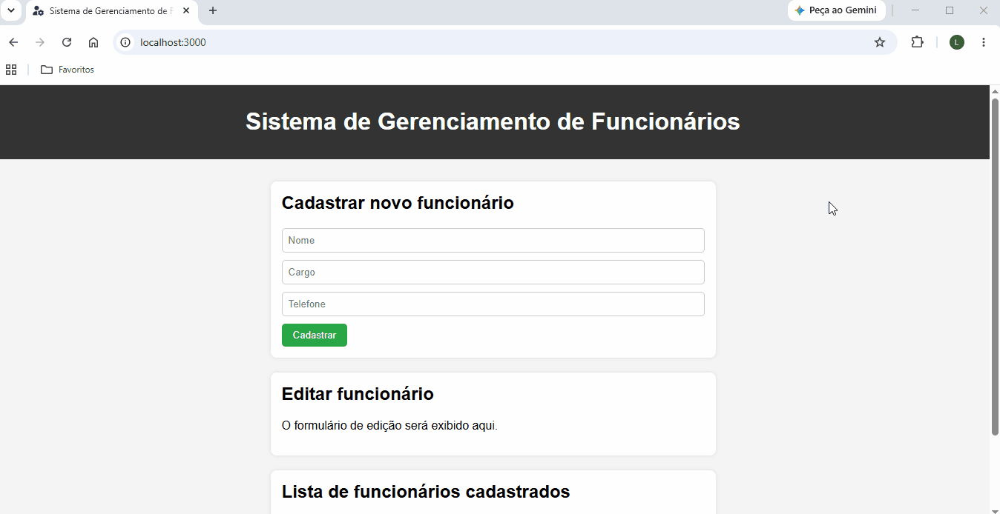

# Employee Management System

## Introdução

O Employee Management System é um projeto pessoal de portfólio que resultou em uma aplicação web full stack para gerenciamento de funcionários.

A aplicação foi desenvolvida com Node.js, Express, PostgreSQL, HTML, CSS e JavaScript.

A aplicação permite visualizar, cadastrar, editar e excluir funcionários por meio de uma interface web integrada a uma API REST.

## Status do projeto

✅ Concluído

## Demonstração

### Interface web da aplicação


### Demonstração de uso



## Funcionalidades

A aplicação web oferece as seguintes funcionalidades:

- visualizar a lista de funcionários cadastrados;
- cadastrar um funcionário informando nome, cargo e telefone;
- editar os dados de um funcionário;
- excluir um funcionário.

## Objetivos

O projeto teve como principais objetivos a prática de:

- desenvolvimento de aplicações web;
- organização de projetos Node.js;
- desenvolvimento de APIs REST;
- utilização do PostgreSQL;
- implementação de operações CRUD;
- integração entre frontend e backend;
- consumo de APIs com `fetch`;
- manipulação do DOM com JavaScript;
- implementação de testes automatizados (unitários e de integração);
- utilização de Git e GitHub durante todo o desenvolvimento;
- elaboração de documentação técnica.

## Requisitos

Os requisitos do projeto estão documentados em [`docs/requirements.md`](docs/requirements.md).

## Tecnologias utilizadas

### Backend

- Node.js
- Express

### Frontend

- HTML
- CSS
- JavaScript

### Banco de dados

- PostgreSQL

### Testes

- Jest
- Supertest

### Ferramentas

- Git
- GitHub

## Arquitetura

A aplicação web está organizada em três partes principais:

- **Frontend:** responsável pela interface web da aplicação e pela interação com a API REST.
- **Backend:** responsável pela implementação da API REST e pela comunicação com o banco de dados.
- **Banco de dados:** responsável pelo armazenamento dos dados dos funcionários.

### Backend

A estrutura do backend está organizada da seguinte forma:

- **Routes:** definem os endpoints da API REST e direcionam as requisições HTTP para a camada Controller.
- **Camada Controller:** recebe as requisições HTTP, define as respostas HTTP e delega as operações de persistência à camada Repository.
- **Camada Repository:** concentra a comunicação com o banco de dados e executa as consultas SQL.

### Frontend

Os arquivos estáticos do frontend são servidos pelo próprio Express.

O JavaScript do frontend está organizado em três módulos:

- **api.js:** define funções responsáveis pela comunicação com a API REST.
- **ui.js:** define funções responsáveis pelo comportamento da interface web.
- **main.js:** orquestra as funções dos módulos `api.js` e `ui.js`, integrando a comunicação com a API REST ao comportamento da interface web.

### Banco de dados

O projeto utiliza dois bancos de dados PostgreSQL: um destinado ao uso da aplicação web e outro destinado à execução dos testes de integração da API REST.

Ambos os bancos possuem a mesma estrutura, composta pela tabela `employees`:

| Coluna | Tipo | Restrições |
|---------|------|------------|
| `id` | `SERIAL` | `PRIMARY KEY` |
| `name` | `VARCHAR(100)` | `NOT NULL` |
| `position` | `VARCHAR(100)` | `NOT NULL` |
| `phone` | `VARCHAR(15)` | `NOT NULL` |

## Endpoints da API REST

| Método | Endpoint | Descrição |
|---------|----------|-----------|
| `GET` | `/employees` | Retorna a lista de funcionários |
| `POST` | `/employees` | Cria um novo funcionário |
| `PUT` | `/employees/:id` | Atualiza um funcionário existente |
| `DELETE` | `/employees/:id` | Remove um funcionário |

## Estrutura do projeto

```text
employee-management-system/
├── backend/
│   ├── database/
│   │   ├── schema.sql
│   │   └── test_seed.sql
│   ├── src/
│   │   ├── config/
│   │   │   ├── connection.js
│   │   │   └── env.js
│   │   ├── controllers/
│   │   │   └── employeesController.js
│   │   ├── repositories/
│   │   │   └── employeesRepository.js
│   │   ├── routes/
│   │   │   └── employeesRoutes.js
│   │   └── app.js
│   ├── tests/
│   │   ├── helpers/
│   │   │   └── resetTestDatabase.js
│   │   ├── integration/
│   │   │   └── employeesApi.test.js
│   │   └── unit/
│   │       ├── employeesController.test.js
│   │       └── employeesRepository.test.js
│   └── server.js
├── docs/
│   ├── gifs/
│   │   └── demo.gif
│   ├── images/
│   │   └── application.png
│   └── requirements.md
├── frontend/
│   ├── assets/
│   │   └── icons/
│   │       └── favicon.png
│   ├── css/
│   │   └── styles.css
│   ├── js/
│   │   ├── api.js
│   │   ├── main.js
│   │   └── ui.js
│   └── index.html
├── .env.example
├── .env.test.example
├── .gitignore
├── package-lock.json
├── package.json
└── README.md
```

## Como executar localmente

### Pré-requisitos

Para executar o projeto localmente, é necessário ter os seguintes softwares instalados:

- Node.js
- PostgreSQL
- Git

### Instalação

Clone o repositório:

```bash
git clone https://github.com/lorenzofernandesaguiar/employee-management-system.git
```

Acesse a pasta do projeto:

```bash
cd employee-management-system
```

Instale as dependências do projeto:

```bash
npm install
```

### Configuração

Crie os arquivos `.env` e `.env.test` utilizando como base os arquivos `.env.example` e `.env.test.example`.

Em seguida, no arquivo `.env`, atribua um valor à variável de ambiente `PORT`.

#### Banco de dados para o uso da aplicação web

Crie um banco de dados PostgreSQL para o uso da aplicação web.

Utilize o nome `employee_management_system_db` e informe suas credenciais no arquivo `.env`.

Depois, execute o comando abaixo para criar a estrutura deste banco:

```bash
npm run db:schema
```

#### Banco de dados para a execução dos testes de integração da API REST

Crie um banco de dados PostgreSQL para a execução dos testes de integração da API REST.

Utilize o nome `employee_management_system_test_db` e informe suas credenciais no arquivo `.env.test`.

Depois, execute o comando abaixo para criar a estrutura deste banco:

```bash
npm run db:test:schema
```

### Execução da aplicação web

Para iniciar a aplicação web, execute:

```bash
npm run dev
```

Esse comando utiliza o `nodemon`, que reinicia automaticamente o servidor quando alterações são feitas nos arquivos do projeto.

Como alternativa, a aplicação pode ser iniciada sem o `nodemon` utilizando:

```bash
npm start
```

Em ambos os casos, o servidor será iniciado utilizando as configurações definidas no arquivo `.env`.

Após a inicialização do servidor, acesse a aplicação no navegador utilizando o endereço correspondente à porta configurada na variável de ambiente `PORT`. Por exemplo:

```text
http://localhost:3000
```

### Execução dos testes

Para executar todos os testes automatizados, utilize o comando:

```bash
npm test
```

Esse comando executa tanto os testes unitários quanto os testes de integração da API REST.

O ambiente de testes é carregado automaticamente a partir do arquivo `.env.test`.

## Etapas do desenvolvimento

- [x] Definição dos requisitos
- [x] Inicialização da estrutura do projeto
- [x] Inicialização do projeto Node.js
- [x] Configuração do servidor Express
- [x] Configuração da conexão com PostgreSQL
- [x] Criação do schema do banco de dados
- [x] Implementação da camada Repository
- [x] Implementação da camada Controller
- [x] Implementação das rotas da API
- [x] Configuração do ambiente de testes da API
- [x] Implementação dos testes unitários da camada Repository
- [x] Implementação dos testes unitários da camada Controller
- [x] Implementação dos testes de integração da API
- [x] Inicialização da estrutura do frontend
- [x] Configuração do Express para servir o frontend
- [x] Criação da estrutura da interface web
- [x] Implementação dos estilos da interface web
- [x] Implementação do cliente da API
- [x] Implementação do comportamento da interface web
- [x] Integração do frontend

## Decisões de projeto

### Validação de valores contendo apenas espaços em branco

Nem a interface web nem a API REST rejeitam valores contendo apenas espaços em branco.

Essa decisão foi adotada para evitar validações adicionais que não agregariam valor aos objetivos do projeto. Além disso, essa decisão mantém a consistência entre o comportamento da interface e da API.

Em um cenário de produção, seria recomendável que tanto a interface quanto a API validassem os valores, rejeitando, por exemplo, aqueles compostos apenas por espaços em branco.

### Validação do tamanho máximo dos valores

A validação do tamanho máximo dos valores é realizada apenas na interface web da aplicação.

Essa decisão foi adotada para manter a API REST com validações mais simples. Além disso, essa decisão é suficiente para o escopo do projeto, pois o frontend é o único cliente previsto para consumir a API no projeto.

Em um cenário de produção, seria recomendável que a API validasse o tamanho máximo dos valores, retornando um erro de validação antes da tentativa de persistência no banco de dados.

### Ausência de tratamento de erros na interface web

A interface web não realiza tratamentos específicos para respostas de erro (`400`, `404` e `500`) enviadas pela API REST.

Essa decisão foi adotada para manter o foco nos objetivos do projeto, priorizando a implementação da integração entre frontend e backend em detrimento de mecanismos adicionais de tratamento de falhas.

Além disso, durante o fluxo normal da aplicação web, não é esperado que a API envie uma resposta de erro, pois o frontend:

- é o único cliente previsto para consumir a API;
- realiza as validações previstas no projeto antes do envio das requisições;
- somente disponibiliza operações de edição e exclusão para funcionários existentes.

Ainda assim, para manter o contrato da API, os códigos HTTP `400 (Bad Request)`, `404 (Not Found)` e `500 (Internal Server Error)` permanecem implementados.

Em um cenário de produção, seria recomendável que a interface tratasse adequadamente as respostas de erro da API, apresentando mensagens ao usuário e adotando estratégias para lidar com falhas de comunicação e erros inesperados.

## Autor

O projeto foi desenvolvido por **Lorenzo Fernandes Aguiar**.

- GitHub: https://github.com/lorenzofernandesaguiar
- LinkedIn: https://www.linkedin.com/in/lorenzo-fer/
- Portfólio: https://lorenzofernandesaguiar.github.io/